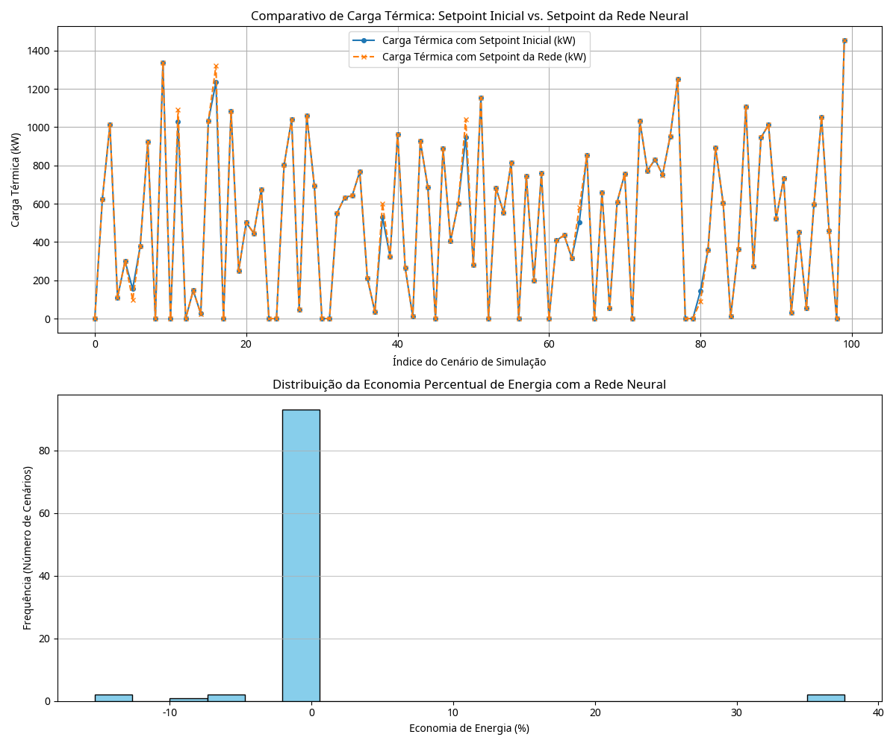

# MBA_USP_ESALQ_TCC_DEEPLEARNING
Apresento meu Tcc desenvolvido no curso de MBA Ciencia de dados, onde abordo a tematica do treinamento de maquina, focado em eficiencia energetica para chillers de centrais de agua gelada. Com o objetivo em deixar o equipamento mais autonomo na descisão de habilitar ou não, mudar o setpoint pra mais ou menos.

 
  
 
    
